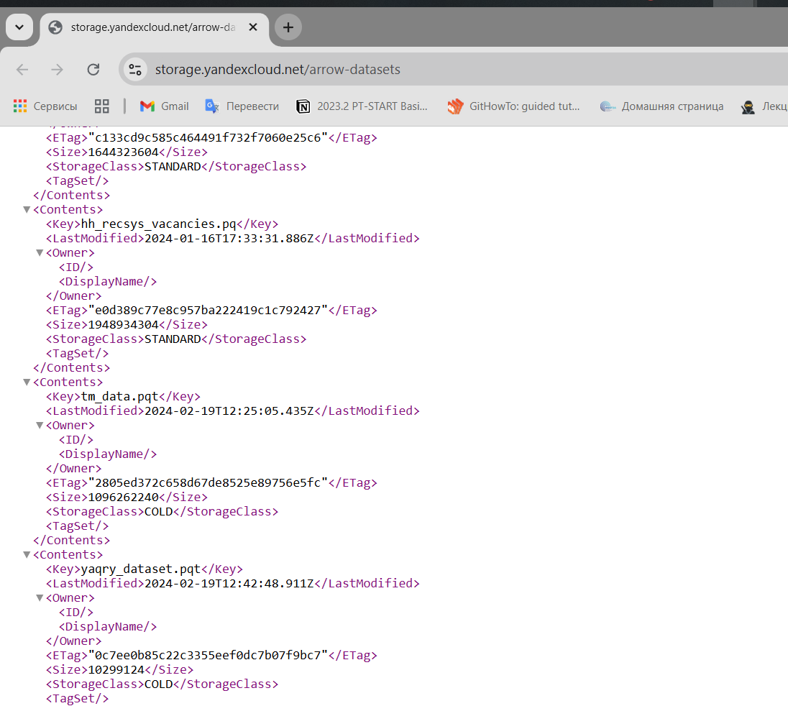
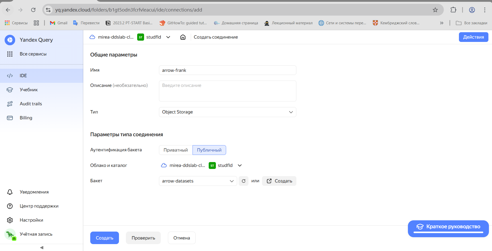
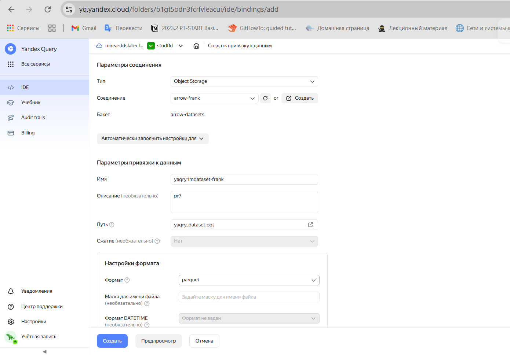
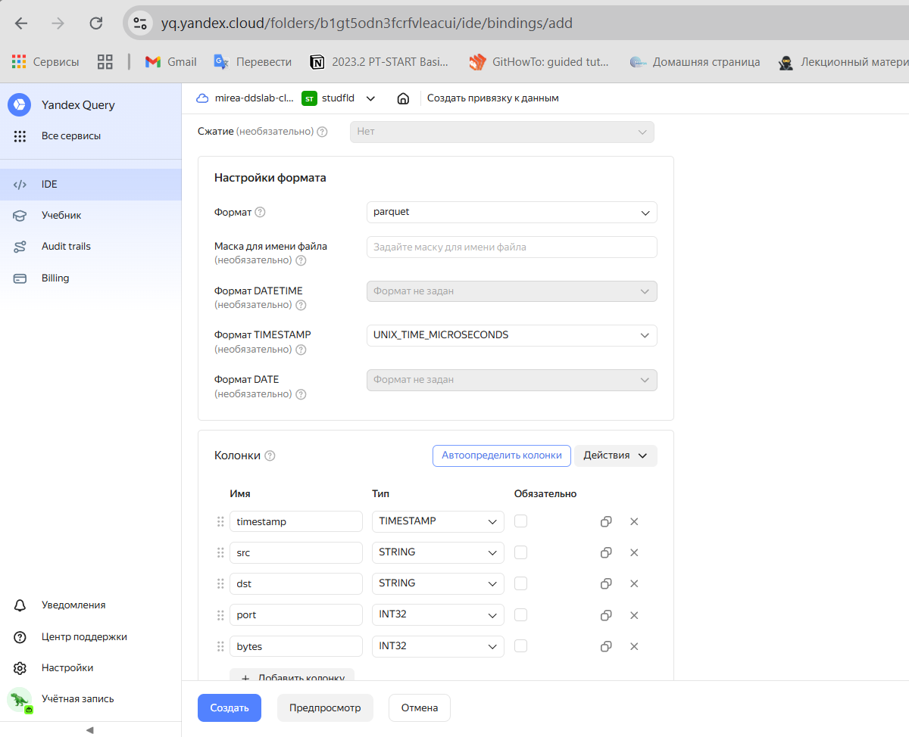
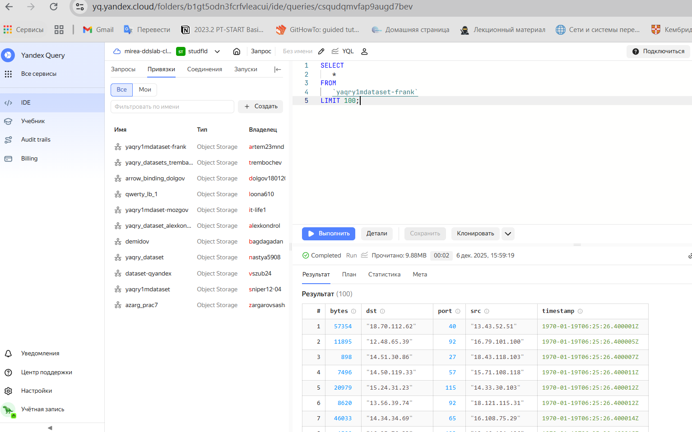
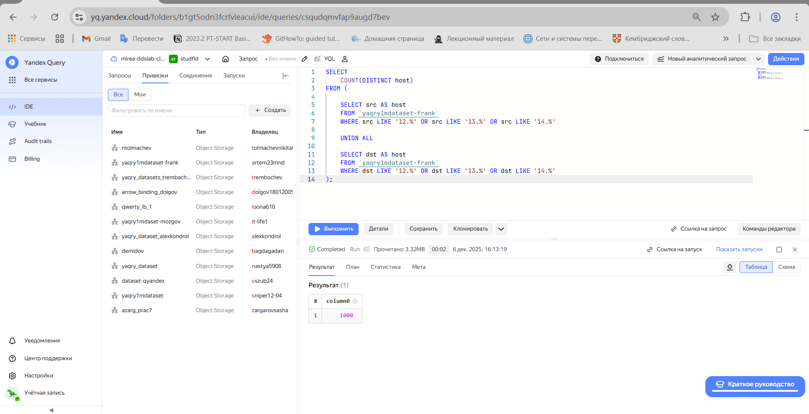
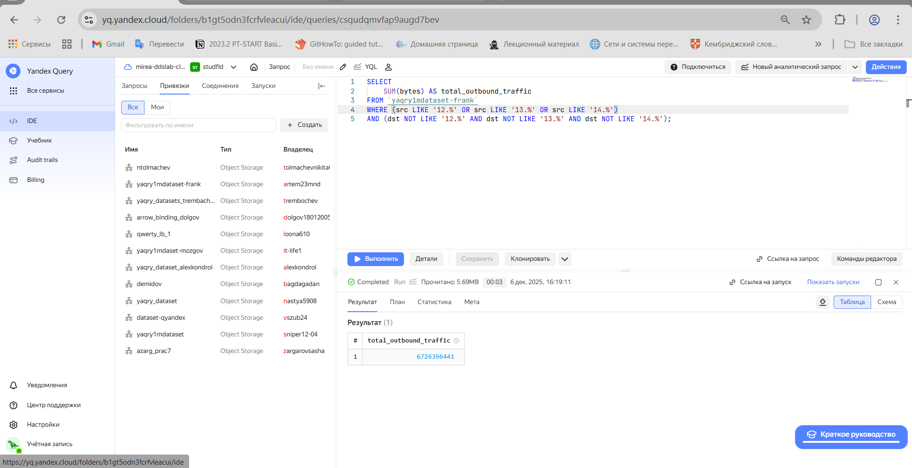
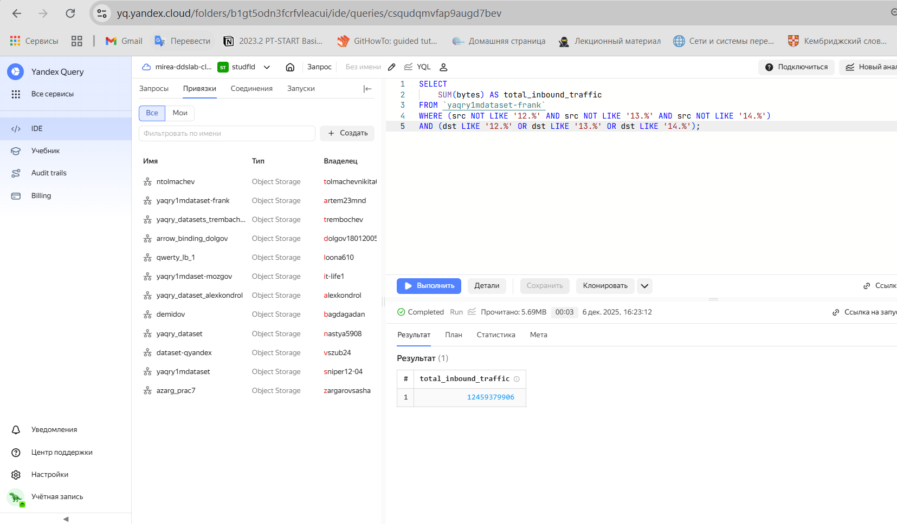

# Практическая работа 007
artem23mnd@yandex.ru

## Цель работы

1.  Изучить возможности технологии Yandex Query для анализа
    структурированных наборов данных
2.  Получить навыки построения аналитического пайплайна для анализа
    данных с помощью сервисов Yandex Cloud
3.  Закрепить практические навыки использования SQL для анализа данных
    сетевой активности в сегментированной корпоративной сети

## Исходные данные

1.  Программное обеспечение Windows 10
2.  Rstudio Desktop
3.  Интерпретатор языка R 4.5.2
4.  Выгрузки данных журнала Windows Active Directory

## Задание

Используя сервис Yandex Query настроить доступ к данным, хранящимся в
сервисе хранения данных Yandex Object Storage. При помощи
соответствующих SQL запросов ответить на вопросы

## Ход работы

1.  Проверить доступность данных в Yandex Object Storage  
    1.1. Проверить доступность данных (файл yaqry_dataset.pqt) в бакете
    arrow-datasets S3 хранилища Yandex Object Storage.

2.  Подключить бакет как источник данных для Yandex Query  
    2.1. Создать соединение для бакета в S3 хранилище (Заполнить поля с
    учетом допустимых символов, выбрать тип аутентификации – публичный.
    Ввести имя бакета в соответствующее поле и сохранить )  
    2.2. Создать и настроить привязку (Указать какой объект использовать
    в качестве источника данных).

3.  Анализ  
    3.1. Известно, что IP адреса внутренней сети начинаются с октетов,
    принадлежащих интервалу 12-14. Определить количество хостов
    внутренней сети, представленных в датасете.  
    3.2. Определить суммарный объем исходящего трафика.  
    3.3. Определить суммарный объем входящего трафика.

### Шаг 1.

### Проверить доступность данных в Yandex Object Storage

1.1. Проверить доступность данных (файл yaqry_dataset.pqt) в бакете
arrow-datasets S3 хранилища Yandex Object Storage.

Перейдем по ссылке https://storage.yandexcloud.net/arrow-datasets и
посомтрим доступность данных

<figure>

<figcaption aria-hidden="true">Доступность данных</figcaption>
</figure>

## Шаг 2

#### Подключить бакет как источник данных для Yandex Query

2.1. Создать соединение для бакета в S3 хранилище (Заполнить поля с
учетом допустимых символов, выбрать тип аутентификации – публичный.
Ввести имя бакета в соответствующее поле и сохранить )

<figure>

<figcaption aria-hidden="true">Соединение для бакета</figcaption>
</figure>

2.2. Создать и настроить привязку (Указать какой объект использовать в
качестве источника данных).

<figure>

<figcaption aria-hidden="true">Настройка привязки данных</figcaption>
</figure>

<figure>

<figcaption aria-hidden="true">Опишем данные в колонках</figcaption>
</figure>

<figure>

<figcaption aria-hidden="true">Успешное подключение</figcaption>
</figure>

### Шаг 3

#### Анализ

3.1 Известно, что IP адреса внутренней сети начинаются с октетов,
принадлежащих интервалу \[12-14\]. Определим количество хостов
внутренней сети, представленных в датасете

<figure>

<figcaption aria-hidden="true">Количество хостов внутренней
сети</figcaption>
</figure>

3.2 Определите суммарный объем исходящего трафика

<figure>

<figcaption aria-hidden="true">Суммарный объем исходящего
трафика</figcaption>
</figure>

3.3 Определите суммарный объем входящего трафика

<figure>

<figcaption aria-hidden="true">Суммарный объем входящего
трафика</figcaption>
</figure>

### Шаг 4

Отчёт написан и оформлен
